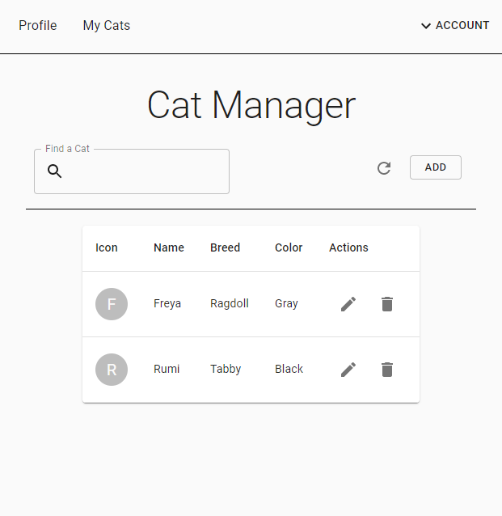
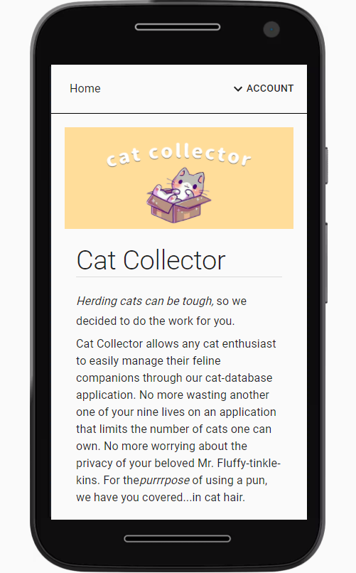
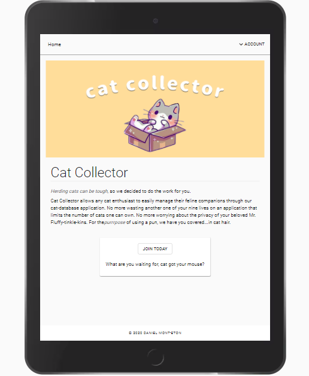

# Cat Collector

Explore the [project page](https://github.com/dansirdan/revature-cat-app)

## Table of Contents

- [About the Project](#about-the-project)
  - [Responsive ](#responsive-design)
  - [Frontend](#frontend)
  - [Backend](#backend)
- [Roadmap](#roadmap)
- [License](#license)
- [Contact](#contact)
- [Acknowledgements](#acknowledgements)

## About The Project

Artist Melony Mont-Eton's personal gallery site with Gallery, About, and Contact pages. The site will be fully responsive and made with React.

### Responsive Design

Using Material-UI to create seamless responsive design through the use of their design system, web accessibility tools, and component library!

### Frontend

- React.js
- Material-UI
- S3 Amazon Static Web Hosting

### Backend

- AWS EC2 Instance hosting
- RDS Amazon Web Services
- Jenkins CI/CD Pipelines
- Java Servlet RESTful API

## Roadmap

Current known issues:

Track [open issues](https://github.com/dansirdan/revature-cat-app/issues)

## License

MIT License

Copyright (c) 2020 Daniel Mont-Eton

## Contact

Twitter - [@DanielMont_Eton](https://twitter.com/DanielMont_Eton)

LinkedIn - [LinkedIn](https://www.linkedin.com/in/daniel-mont-eton-43a81055/)

## CONTRIBUTIONS

[catCollector API](https://github.com/jwdavis1989/catCollector)
[jwdavis1989](https://github.com/jwdavis1989)